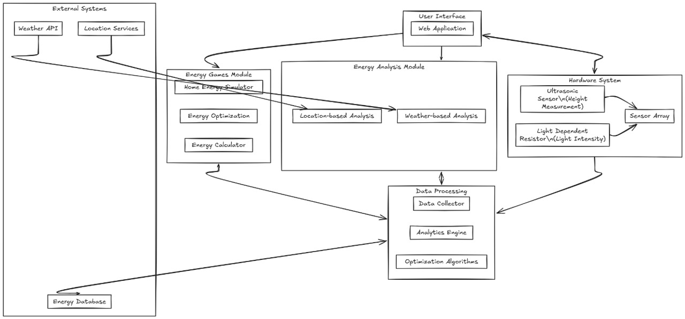

# ⚡ ENERGY GAME: Operation and Control of Renewable Energy Sources

A gamified simulation system integrated with real-time environmental inputs to manage and optimize renewable energy consumption in households. Built under the **E-Yantra initiative**, this project merges **simulation, hardware and AI-based recommendations**.



---

## 🧠 Project Summary

**ENERGY GAME** is a **simulation + control system** that helps users understand how to manage renewable energy from **solar, wind, and hydro sources**. It provides:
- Real-time **energy allocation and optimization**
- **Weather/location-based recommendations**
- Integration with **ESP32 + sensors** to predict actual renewable generation potential.

---

## 🚀 Key Features

| Feature                            | Description                                                                                 |
|-----------------------------------|---------------------------------------------------------------------------------------------|
| 🎮 Energy Grid Game               | Simulated energy management game (see below)                                                |
| 🌤 Weather-Based Recommendations | Dynamic suggestions based on solar irradiance, wind speed, rainfall                         |
| 🌍 Location-Aware Optimizations   | Region-specific energy source guidance (e.g., wind in coastal areas, solar in deserts)     |
| 📟 Sensor-Based Predictions       | Uses LDR & ultrasonic sensors to predict energy potential via ESP32                         |
| 📊 Energy Calculation Dashboard   | Optimized allocation based on cost, green factor, or balanced approach                     |
| 📡 Real-Time Data Integration     | Combines API + sensor input to dynamically adapt strategies                                 |
| 📈 Impact Reports                 | Shows potential cost savings, carbon reduction, and usage charts                           |
| 🧠 Educational Value              | Teaches real-world constraints through interactive design                                   |

---

## 🛠️ Hardware & Software Stack

### 🔌 Hardware
- **ESP32** microcontroller
- **HC-SR04** Ultrasonic Sensor – For water height → hydro energy
- **LDR Sensor** – For light intensity → solar potential
- **Zener Diode & Op-Amp** – Signal conditioning
- **Breadboard & Jumper Wires**

### 💻 Software
- **Frontend**: React / HTML5 + JS + CSS
- **Arduino IDE**: ESP32 code for sensor reading
- **Weather API**: OpenWeatherMap API

---

## 🧪 How It Works

### 🏠 Simulation Gameplay
- Each day, the system assigns a fixed **energy budget**.
- Users allocate energy to appliances.
- Game provides **feedback and efficiency score**.

### 🌦 Weather & Location Adaptation
- Uses OpenWeatherMap to fetch real-time:
  - Sunlight intensity
  - Wind speed
  - Rain probability
- Updates strategy to reflect source potential.

### 🔋 Optimization Algorithms
- **Green Strategy**: Maximize renewable source use
- **Cost Strategy**: Prioritize lowest-cost source
- **Balanced Strategy**: Blend based on availability and demand

### 🧾 Prediction Hardware Flow
- **LDR** reads sunlight → predicts solar output
- **Ultrasonic sensor** reads water level → predicts hydro potential
- Readings sent to server via ESP32 serial/HTTP
- Dashboard updates predictions live

---
### 🧰 Clone the Repository
```bash
git clone https://github.com/your-username/E-Yantra.git
cd energy-game
